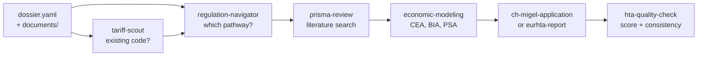

# HEOR Skills

[](https://www.apache.org/licenses/LICENSE-2.0)
[](packages/heor-engine/)
[](TESTING.md)
[](https://github.com/AliakseiT/heor-skills/actions/workflows/ci.yml)

Open-source **HEOR (Health Economics and Outcomes Research)** and **medical
device market-access** skills for AI agents. Nine skills covering the full
reimbursement journey — from pathway selection to application drafting — backed
by a deterministic economic modeling engine and six official reimbursement
databases across Switzerland, Germany, France, and the USA.

Works with **Claude Code**, **Codex**, **Cursor**, **Gemini CLI**, and any
Agent-Skills-compatible harness. Skills are harness-neutral: no reliance on
Claude-specific tools in core workflows.

> **Status: pre-release.** Not yet published to any marketplace. The engine
> and data pipeline are production-ready; skill workflows are being refined.

## Pipeline



A dossier is a plain directory. Each skill reads from it, writes to it, and
picks up where the previous one left off. Start with just a `dossier.yaml`
describing your product, and work through the pipeline.

## Skills

| Skill | What it does |
|---|---|
| regulation-navigator | Maps a product to its reimbursement pathway across CH, DE, FR, US, UK with prerequisites and timelines |
| tariff-scout | Searches official reimbursement lists for existing codes and comparable products |
| prisma-review | Runs a PRISMA 2020 systematic literature review: PICO, search, screening, diagram, synthesis |
| economic-modeling | Builds and runs cost-effectiveness and budget-impact models through a deterministic engine |
| ch-migel-application | Drafts a Swiss MiGeL (device list) application form |
| ch-analysenliste-application | Drafts a Swiss Analysenliste (laboratory test) application form |
| ch-klv-forms | Drafts Swiss KLV forms: Meldung, Antrag, Umstrittenheit |
| eurhta-report | Drafts a EUnetHTA Core Model HTA report chapter by chapter |
| hta-quality-check | Scores a draft against BAG rubrics and checks cross-section consistency |

## Economic engine

The `@heor/engine` package is a pure-TypeScript economic modeling engine with
zero runtime dependencies. Six model types (decision tree, Markov chain,
budget impact, state transition, partitioned survival, discrete event
simulation), Monte Carlo PSA with CEAC and tornado diagrams, batch scenario
comparison, Excel export with live formulas, and structured run comparison.

```bash
npx tsx packages/heor-engine/src/cli/run-model.ts examples/markov-chain.json
npx tsx packages/heor-engine/src/cli/run-psa.ts examples/psa-markov-chain.json
npx tsx packages/heor-engine/src/cli/export-excel.ts models/runs/baseline.json
```

## Reimbursement data

Six official reimbursement lists are normalized to versioned JSON and
refreshed monthly by CI:

| Country | List | Source |
|---|---|---|
| Switzerland | MiGeL (devices and aids) | BAG/FOPH |
| Switzerland | Analysenliste (laboratory tests) | BAG/FOPH |
| Germany | DiGA (digital health apps) | BfArM FHIR API |
| Germany | HMV (assistive devices) | GKV-Spitzenverband API |
| France | LPP (medical products and services) | CNAM / ameli |
| USA | HCPCS Level II (procedure codes) | CMS |

## Getting started

```bash
git clone <this-repo>
cd heor-skills
pnpm install

# Run the engine tests
pnpm -r test

# Explore the demo dossier
ls examples/demo-dossier/
```

Install as a Claude Code plugin (once published):

```
/plugin marketplace add <owner>/heor-skills
/plugin install heor@heor-skills
```

## Layout

```
plugins/heor/skills/           9 skills, each with SKILL.md + references
packages/heor-engine/          economic modeling engine (npm-publishable)
data/{ch,de,fr,us}/            normalized reimbursement data (JSON, versioned)
tools/data-pipeline/           fetch + normalize scripts (run by CI cron)
examples/demo-dossier/         fully populated example dossier (SereniCBT)
docs/cookbook/                 recipe guides for common workflows
```

## Principles

- **Country first, language second.** Data and templates are organized by
  jurisdiction. Language is a variant within a jurisdiction, not the other
  way around.
- **The engine does the math.** Economic model results come from
  `@heor/engine` CLI runs, never from the LLM.
- **Drafts, not submissions.** Every skill ends with a human-review
  disclaimer. Output is a starting point for a qualified professional.
- **No servers, no databases.** Markdown, JSON, and one TypeScript engine.
  The data pipeline runs in CI and opens a PR when official sources change.

## License

Apache-2.0. Drafts produced with these skills require review by qualified
professionals. Nothing here is regulatory, clinical, or reimbursement
advice.

## Who is this for

- **HEOR professionals** building market-access dossiers for medical devices
  and digital health interventions across European and US markets
- **AI agent developers** who need deterministic, auditable economic modeling
  rather than LLM-generated arithmetic
- **Regulatory affairs teams** navigating Swiss (MiGeL, Analysenliste, KLV),
  German (DiGA, HMV), French (LPP), or US (HCPCS) reimbursement pathways
- **Health technology assessment researchers** running PRISMA literature
  reviews and cost-effectiveness analyses

## Keywords

HEOR, health economics, outcomes research, HTA, health technology assessment,
market access, medical devices, digital health, reimbursement, cost-effectiveness
analysis, CEA, budget impact analysis, BIA, Markov model, decision tree,
partitioned survival, discrete event simulation, probabilistic sensitivity
analysis, PSA, ICER, QALY, PRISMA, systematic literature review, PICO,
EUnetHTA, MiGeL, Analysenliste, KLV, DiGA, HMV, LPP, HCPCS, Claude Code skills,
AI agent skills, Switzerland, Germany, France, USA
