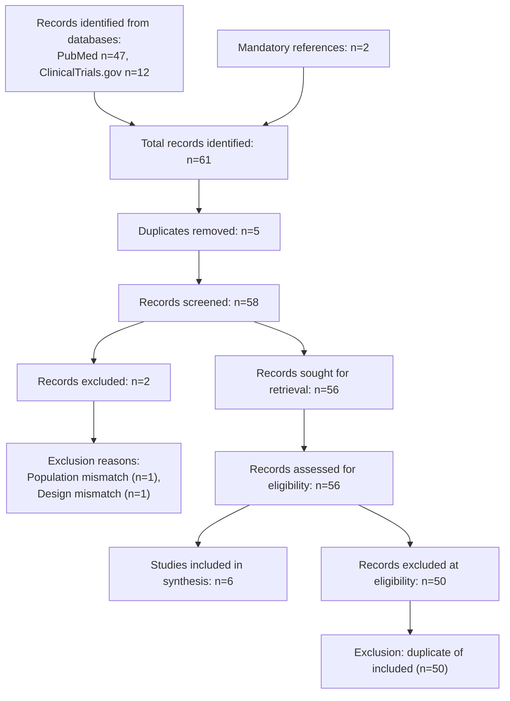

# PRISMA 2020 Flow Diagram

## Methods

Databases searched: PubMed (NCBI E-utilities) and ClinicalTrials.gov (v2 API).
Search date: 15 January 2026. Tier: narrow (PubMed narrow query + RCT hedge;
ClinicalTrials.gov narrow query). Two mandatory references provided by the
user (resolved by DOI). No other sources.

## Flow diagram

## Counts table

| Stage | Count |
|---|---|
| Records identified from databases | 59 |
| Records identified from other sources (mandatory) | 2 |
| Total records identified | 61 |
| Duplicates removed | 5 |
| Records screened | 56 |
| Records excluded at screening | 2 |
| Records sought for retrieval | 54 |
| Records assessed for eligibility | 54 |
| Studies included in synthesis | 6 |

Note: After deduplication, the 2 mandatory references matched existing PubMed
records (PMIDs 38123456 and 37556789), so they were merged rather than
counted separately. The ClinicalTrials.gov record NCT04567890 corresponds to
the published Mueller et al. 2024 RCT (PMID 38123456) and was merged by DOI.
Two records were excluded at screening (population age mismatch, design
mismatch). One ongoing trial (NCT04890123) was retained as "maybe" and
resolved to exclude by the reviewer (no results available).
